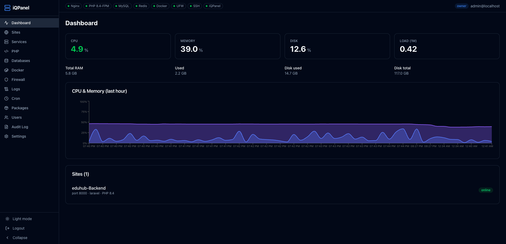

# iQPanel

Laravel-first Ubuntu control panel. One command to install. Manage PHP, Nginx, databases, SSL, Docker, firewall, cron, and logs from the browser.



## Install

Ubuntu 22.04 / 24.04 / 26.04 · amd64 or arm64

**Localhost** (default, port 4173)

```bash
curl -fsSL https://raw.githubusercontent.com/Iraqi-Open-Source/iQPanel/main/installer/install.sh | sudo bash
```

**Public HTTP**

```bash
curl -fsSL https://raw.githubusercontent.com/Iraqi-Open-Source/iQPanel/main/installer/install.sh | sudo bash -s -- --expose-dashboard --dashboard-port=8080
```

**HTTPS** (recommended)

```bash
curl -fsSL https://raw.githubusercontent.com/Iraqi-Open-Source/iQPanel/main/installer/install.sh | sudo bash -s -- \
  --dashboard-domain=panel.example.com \
  --email=you@example.com
```

The installer prints the dashboard URL and a one-time password. Sign in with `admin@localhost`. Save the password — it is shown only once.

| Flag | Default | What it does |
|------|---------|--------------|
| `--dashboard-port=N` | `4173` | Panel port |
| `--expose-dashboard` | off | Listen on all interfaces |
| `--dashboard-domain=DOMAIN` | — | Let's Encrypt + Nginx proxy |
| `--email=EMAIL` | — | Certbot email |
| `--stack=all\|lnmp\|llmp\|lamp` | none | Pre-install a web/db stack |

## What you can do

- **Sites** — 5-step wizard to deploy Laravel (or any git app)
- **PHP** — install 7.4–8.5, set the system default, edit per-site pools
- **Databases** — MySQL, MariaDB, PostgreSQL, Redis; credentials go into `.env`
- **Docker** — containers, images, compose, logs
- **Server** — systemd, UFW, cron, packages, live logs
- **SSL** — issue and renew with Certbot
- **Updates** — Settings → Updates

## Deploy a Laravel app

1. **Sites → New Site** → type `Laravel`
2. Paste the git URL
3. Set a domain, or pick an auto port (8000–8999)
4. Add the deploy key to your repo → **Test connection**
5. Review the recipe → **Deploy Site**

The panel clones the repo, runs the recipe, writes Nginx + PHP-FPM, and reloads. Later deploys run `artisan down → git pull → recipe → artisan up`. Rollback is one click.

For auto-deploy on push, add a GitHub webhook from the site's **Webhook** tab.

## Develop

Needs Node 24.

```bash
node server/main.js
cd web && npm install && npm run dev
```

Vite proxies API calls to `http://localhost:4173`.

## License

MIT
