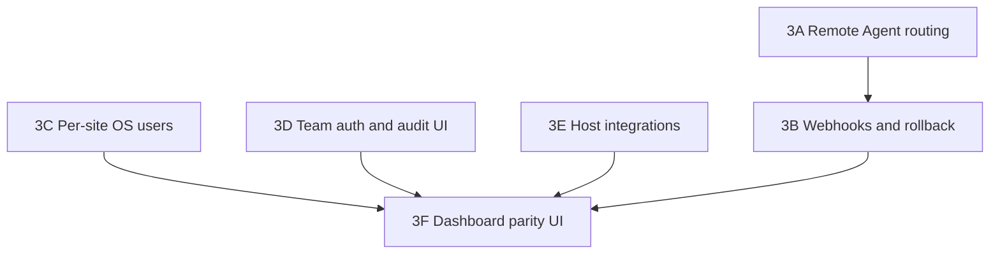

# Open-Source Server Control Panel — Project Plan

A free, open-source alternative to cPanel / Plesk / OpenPanel — site & app hosting management for Ubuntu servers (PHP, Node, Python, Docker, databases, backups, cron, systemd, terminal, logs).

---

## 1. Vision

A single self-hosted web dashboard that lets someone take a fresh Ubuntu VPS and:

- Install & manage the whole stack (Nginx, Apache, PHP-FPM multi-version, Node multi-version, Python, MySQL, PostgreSQL, Docker, Certbot).
- Group everything by **Site** (one site = one app/project with its own domain/port, runtime, database, deploy key, cron jobs, systemd services, backups, logs).
- Deploy straight from a GitHub repo using an auto-generated SSH deploy key.
- Manage databases, backups (local/FTP/Telegram), Docker, crontabs, systemd services, and a web terminal — all from one UI.

Comparable prior art (for reference, not code to copy): cPanel, Plesk, OpenPanel, aaPanel, RunCloud, Ploi, CapRover, Coolify. Your differentiators: fully open-source, free, self-hosted, GitHub-first deploys, and a template system for systemd services.

---

## 2. Target Environment

| Item | Support |
|---|---|
| OS | Ubuntu 20.04, 22.04, 24.04 LTS (amd64 & arm64) |
| Web servers | Nginx, Apache2 (choose per site) |
| PHP | 7.4 – 8.4 via `ppa:ondrej/php`, multiple versions side-by-side with PHP-FPM pools |
| Node | via `nvm` or `n`, multiple versions side-by-side |
| Python | system + `pyenv` for multiple versions, `venv` per site |
| Databases | MySQL 8, MariaDB, PostgreSQL 13–16 |
| SSL | Let's Encrypt via Certbot (nginx/apache plugin) |
| Containers | Docker Engine + Docker Compose v2 |
| Firewall | UFW |
| Install user | root **or** a sudo-enabled non-root user |

---

## 3. High-Level Architecture

Don't build this as one monolithic root process. Split it in two, like Docker/CapRover do:

```mermaid
flowchart LR
    Browser -- HTTPS --> WebUI[Panel Web App\n(runs as low-priv user)]
    WebUI -- local auth'd socket/API --> Agent[Node Agent (root, systemd service)]
    Agent --> OS[(Nginx / Apache / PHP-FPM / MySQL / Postgres / Docker / UFW / systemd / cron)]
    WebUI --> DB[(Panel's own DB: sites, users, jobs, logs)]
    Agent -- job queue --> Worker[Background Job Worker\n(backups, deploys, installs)]
```

**Why split it:** the browser-facing app never needs root. Only the Agent (a small systemd service) touches the OS. This avoids ever storing a root password in the web session, and is the pattern used by every serious panel/orchestrator.

- **Web UI / API** — Node.js (NestJS or Express) or Go, + a React/Vue dashboard. Runs as an unprivileged user (e.g. `panel`).
- **Agent** — a small daemon (Go or Node) installed as a `systemd` service running as root, listening on a local Unix socket (`/run/panel-agent.sock`). Only the Web UI process can talk to it (filesystem permissions + a shared token).
- **Job Queue** — Redis + BullMQ (Node) or a simple SQLite-backed queue, for long tasks: cloning repos, running composer/npm install, backups, Docker builds.
- **Panel's own database** — SQLite for simplicity (single server) or PostgreSQL if you want multi-server later.

This also gives you a natural upgrade path to **multi-server management** later: one Web UI, many Agents (one per managed server), each Agent authenticated with its own token.

---

## 4. Suggested Tech Stack

| Layer | Suggestion | Why |
|---|---|---|
| Agent (root daemon) | Go (single static binary) or Node.js | Easy to distribute, small footprint, good OS/process control libs |
| Web backend | NestJS (Node/TypeScript) | Structured, good for a modular plugin system (each feature = a module) |
| Frontend | React + Tailwind, or Vue 3 | Component-driven dashboard, easy to theme |
| Realtime (logs/terminal) | WebSockets (Socket.IO) | Streaming logs, terminal, job progress |
| Terminal | `node-pty` + `xterm.js` | Real interactive shell in browser |
| Queue | BullMQ + Redis (or SQLite queue for zero-dependency mode) | Reliable background jobs with retries |
| Panel DB | SQLite (default) / PostgreSQL (optional) | Zero-config by default |
| Docker control | `dockerode` (Node) talking to `/var/run/docker.sock` | No shelling out, structured API |
| Config templating | Handlebars/EJS or Go templates | Render nginx/systemd/env templates |

License suggestion: **AGPL-3.0** if you want to prevent closed-source hosted forks, or **MIT** if you want maximum adoption with no restriction — worth deciding early since it affects contributions.

---

## 5. Core Modules

### 5.1 Server Bootstrap (first-run installer)
One install script (`curl | bash` style, but reviewed/idempotent) that:
1. Detects Ubuntu version, architecture.
2. Installs base packages: `nginx`, `apache2` (disabled by default, enabled on demand), `certbot`, `ufw`, `curl`, `git`, `unzip`, `software-properties-common`.
3. Adds `ppa:ondrej/php` and installs a default PHP version + `php-fpm`.
4. Installs `nvm` (or `n`) for Node, installs one default LTS Node version.
5. Installs Python3, `python3-venv`, `pip`, optional `pyenv`.
6. Installs MySQL/MariaDB and/or PostgreSQL (user picks during install).
7. Installs Docker Engine + Compose plugin.
8. Creates the `panel` system user (if not running as one already).
9. Installs and enables the **Agent** as a root systemd service.
10. Starts Web UI (as its own systemd service running as `panel` user).
11. Prints the dashboard URL + one-time admin password.

### 5.2 Sites (the core grouping concept)
A **Site** is the unit everything else hangs off:

```
Site
 ├─ name (slug, editable)
 ├─ type: php | node | python | static | docker | dotnet
 ├─ source: git repo URL (SSH) | manual upload | existing folder
 ├─ deploy key (auto-generated per site)
 ├─ domain(s) OR local port
 ├─ ssl: none | letsencrypt
 ├─ webserver: nginx | apache
 ├─ runtime version: php X.Y / node X.Y / python X.Y
 ├─ php.ini overrides (per-site)
 ├─ database link(s): db engine, db name, db user
 ├─ env file
 ├─ cron jobs (scoped to this site's user)
 ├─ systemd services (from templates)
 ├─ backup policy
 └─ logs (auto-discovered paths)
```

### 5.3 Git Deployment via SSH Deploy Key (as you described)
Flow:
1. User clicks **New Site → Deploy from Git**.
2. Agent runs `ssh-keygen -t ed25519 -f /var/www/sites/<slug>/.ssh/id_ed25519 -N ""` — a **unique key per site**.
3. UI shows the **public key** with a "Copy" button and a link/instructions: *"Add this as a Deploy Key (read-only) in your GitHub repo → Settings → Deploy keys."*
4. User pastes only the **repo SSH URL** (`git@github.com:user/repo.git`) and optionally a custom site name (defaults to repo name).
5. Agent sets `GIT_SSH_COMMAND="ssh -i /var/www/sites/<slug>/.ssh/id_ed25519 -o IdentitiesOnly=yes"` and does the initial clone into `/var/www/sites/<slug>/app`.
6. Subsequent deploys = "Pull latest" button (or optional GitHub webhook for auto-deploy).

This means the panel **never needs the user's personal GitHub credentials or a broad-access PAT** — just a scoped, read-only, per-site key. Good default.

### 5.4 Domain / Port Logic
- **No domain yet:** user picks (or panel auto-assigns) a local port, e.g. `127.0.0.1:8010`. UFW rule opens that port **only if** they explicitly want direct external access; otherwise it stays internal and Nginx/Apache reverse-proxies to it — safer default.
- **Domain added later:** site keeps running on its port; adding a domain just adds a vhost that reverse-proxies (or serves PHP-FPM directly) to that site, then requests Certbot cert.
- **Domain at creation:** create vhost immediately, run `certbot --nginx -d domain.com` (or apache plugin), auto-renew is already handled by certbot's systemd timer.

### 5.5 Runtime Version Selection
- **PHP:** each version installed as `php8.2-fpm`, `php8.3-fpm`, etc. Each site gets its **own FPM pool** (`/etc/php/8.x/fpm/pool.d/<slug>.conf`) with its own `listen = /run/php/<slug>.sock`, and its own `php.ini` overrides via `php_admin_value` directives or a per-pool ini file — this is what lets each site have custom PHP settings without affecting others.
- **Node:** each site's systemd service sets `Environment=PATH=/home/panel/.nvm/versions/node/vX.Y.Z/bin:...` so each app runs its chosen Node version independently.
- **Python:** each site gets its own virtualenv (`/var/www/sites/<slug>/venv`) built with the chosen Python version via `pyenv`.

### 5.6 Database Management
- Supports MySQL/MariaDB and PostgreSQL.
- Actions: create database, create user, set/generate password, grant privileges, **create new** or **attach to existing** db/user (as you described), list/drop databases, run `mysqldump`/`pg_dump` on demand.
- Implementation: agent runs privileged commands via the local MySQL/Postgres admin socket (no need to store the root DB password anywhere reachable by the web layer — the Agent holds it, encrypted at rest).

### 5.7 Docker Management
- Engine-level: install/uninstall Docker, view engine status, prune unused images/volumes.
- Container-level (via `dockerode` against `/var/run/docker.sock`): create, start, stop, restart, remove, exec into, stream logs.
- Compose-level: per-site `docker-compose.yml` support — up/down/build/pull, treated as its own "site type."

### 5.8 Web Terminal
- `node-pty` spawns a real shell (`bash` or `sh`) as a chosen user (site's own user, `www-data`, or admin — scoped by role).
- Streamed to the browser over WebSocket with `xterm.js`.
- Must require the panel's own auth + (optionally) a re-auth prompt before opening a root-capable shell. Log session start/end for auditing; don't log full keystrokes by default (privacy) unless the admin opts in.

### 5.9 Log Viewer & Auto-Discovery
- Per site, auto-detect common log paths based on type:
  - Nginx/Apache: `/var/log/nginx/<slug>-access.log`, `-error.log`
  - PHP-FPM pool log: `/var/log/php<ver>-fpm-<slug>.log`
  - Laravel: `storage/logs/laravel.log`
  - Node/PM2-style: systemd journal (`journalctl -u panel-<slug>-app -f`)
  - Docker: `docker logs -f <container>`
- Stream via WebSocket (`tail -f` equivalent) with search/filter and download.

### 5.10 Crontab Management
- Read/write **per-user** crontabs (`root`, `www-data`, or a dedicated per-site user) via `crontab -u <user> -l` / feeding a temp file to `crontab -u <user> -`.
- UI: add job with a schedule builder (presets + raw cron expression), command, run-as user, enable/disable without deleting, view last-run output (wrap the actual command so stdout/stderr is captured to a per-job log file).

### 5.11 Systemd Service Templates
A template engine that fills in `{{slug}}`, `{{path}}`, `{{user}}`, `{{php_version}}`, `{{node_version}}`, etc., then does `systemctl daemon-reload && systemctl enable --now panel-<slug>-<service>.service`.

Ship built-in templates for:
- Laravel queue worker (`php artisan queue:work`)
- Laravel Horizon
- FastAPI / Uvicorn
- Gunicorn (Django/Flask)
- Node process (Express/NestJS `node dist/main.js` or `npm start`)
- ASP.NET Core (Kestrel, `dotnet MyApp.dll`)
- Generic Python worker / Celery worker

(Full unit file examples in section 8.)

### 5.12 Backups
- **Targets:** files (site folder, excluding `node_modules`/`vendor` optionally) + database dump.
- **Schedule:** cron-based, per site.
- **Destinations:**
  - Local (`/var/backups/panel/<slug>/`)
  - FTP/SFTP upload
  - Telegram (via Bot Token + Chat ID) — split into ≤50MB chunks since that's Telegram's Bot API file size limit, send as `sendDocument`, one message per chunk, with a small manifest so chunks can be reassembled.
- Retention policy: keep last N or last N days, auto-prune older backups.

### 5.13 Users & Sudo Session Handling
Two supported install modes:

**Mode A — recommended:** Install once as root (or via `sudo`) to register the **Agent** as a root systemd service. After that, the Web UI never needs a sudo password again — every privileged action goes through the Agent's authenticated local socket. This is the architecture in section 3 and avoids storing any password at all after setup.

**Mode B — single-process, sudo-per-session (what you described):** If you want the whole panel to run as a single non-root process and use `sudo` interactively:
- Prompt for the sudo password once per browser/login session.
- Cache it **only in server memory** (never on disk), encrypted with a key derived from the session token, with a TTL (mirrors `sudo`'s own 15-minute timestamp cache — you can literally just call `sudo -v` to refresh the timestamp instead of re-sending the password each time).
- Clear it immediately on logout, TTL expiry, or server restart.
- Scope what it can actually do via a tight `/etc/sudoers.d/panel` file limiting the panel user to an explicit list of scripts (`NOPASSWD` or password-required, your choice), e.g.:
  ```
  panel ALL=(root) /usr/local/bin/panel-agent-helper *
  ```
  This is safer than caching a raw account password that could unlock anything — worth doing even if you go with Mode B.

Mode A is strictly more secure and is what's used in section 3's diagram; Mode B is documented here because you asked for it explicitly, but treat it as a fallback, not the default.

---

## 6. Data Model (panel's own database)

Core tables:

- `users` (panel admins/team members, roles)
- `servers` (for future multi-server: host, agent token, status)
- `sites` (slug, type, domain, port, php_version, node_version, python_version, webserver, ssl_status, repo_url, deploy_key_path, status)
- `databases` (site_id, engine, db_name, db_user, host)
- `cron_jobs` (site_id nullable, run_as_user, schedule, command, enabled)
- `systemd_services` (site_id, template, unit_name, status)
- `backups` (site_id, type, destination, path/remote_ref, size, created_at, status)
- `docker_containers` (site_id nullable, container_id, image, status)
- `deployments` (site_id, commit_sha, status, log, triggered_by, timestamp)
- `activity_log` (user_id, action, target, timestamp) — audit trail, important for a panel with terminal + root access

---

## 7. Directory Layout on the Managed Server

```
/etc/panel-agent/                # agent config, encrypted secrets
/var/www/sites/<slug>/
    app/                         # git checkout
    .ssh/id_ed25519(.pub)        # per-site deploy key
    .env
    venv/                        # if python site
/etc/nginx/sites-available/<slug>.conf
/etc/apache2/sites-available/<slug>.conf
/etc/php/<ver>/fpm/pool.d/<slug>.conf
/etc/systemd/system/panel-<slug>-<service>.service
/var/log/panel/<slug>/
/var/backups/panel/<slug>/
```

Consistent naming (`<slug>` everywhere) makes cleanup/uninstall of a site trivial — one command removes vhost, pool, services, cron entries, and logs together.

---

## 8. Example: Deploy a Laravel App (full wizard flow)

This maps directly to the steps you listed:

1. **New Site → Type: PHP (Laravel)**
2. **Source:** paste GitHub SSH URL, or pick "already cloned" if the folder exists.
   - Panel generates deploy key → shows public key → user adds it to GitHub repo → confirms → panel clones.
3. **Name:** optional, defaults to repo name (slugified).
4. **Domain or IP+Port:** enter domain now, or skip and use `server_ip:port` for now, add domain later.
5. **Web server:** Nginx or Apache.
6. **PHP version:** choose from installed versions (or trigger install of a new one), sets up dedicated FPM pool.
7. **Custom php.ini:** optional textarea → merged into the pool's ini overrides (e.g. `upload_max_filesize`, `memory_limit`).
8. **Node version:** optional, only if the project needs a build step (Vite/Mix).
9. **Database:** choose provider (MySQL/PostgreSQL) → create new DB+user or attach existing.
10. Panel writes the vhost, enables the FPM pool, requests SSL if a domain was given, opens the port in UFW only if no domain/direct access requested.
11. **Env setup — panel pauses here** (as you specified) and shows:
    ```bash
    sudo cp .env.example .env
    ```
    then lets the user **edit `.env` directly in the UI** (DB creds pre-filled from step 9) before continuing.
12. **Run install commands** (shown live in a log panel, streamed from the Agent/job worker):
    ```bash
    composer install --no-dev --optimize-autoloader
    sudo chmod -R 775 bootstrap/cache/ storage/
    sudo chown -R www-data:www-data .
    sudo -u www-data php artisan storage:link
    sudo -u www-data php artisan optimize:clear
    sudo -u www-data php artisan migrate --seed
    ```
13. **Optional:** create a systemd service from the "Laravel Queue Worker" template, and/or a cron entry for the scheduler:
    ```
    * * * * * cd /var/www/sites/<slug>/app && php artisan schedule:run >> /dev/null 2>&1
    ```
14. **Backups:** attach a backup policy (files + DB dump) with a schedule and destination.

---

## 9. Example Flows: Other Frameworks

### FastAPI (Python)
1. Clone repo (same deploy-key flow).
2. Choose Python version → panel creates `venv`, runs `pip install -r requirements.txt`.
3. Choose DB, fill `.env`/`settings.py` values.
4. Domain/port → Nginx reverse-proxies to `127.0.0.1:<port>`.
5. Create systemd service from **"FastAPI / Uvicorn"** template:
   ```ini
   ExecStart=/var/www/sites/<slug>/venv/bin/uvicorn app.main:app --host 127.0.0.1 --port {{port}} --workers 2
   ```
6. `systemctl enable --now panel-<slug>-app`.

### ASP.NET Core
1. Clone repo, choose .NET SDK/runtime version (installed via Microsoft's apt feed).
2. `dotnet restore && dotnet publish -c Release -o out`.
3. Domain/port → Nginx reverse-proxies to Kestrel's port.
4. Systemd template **"ASP.NET Core (Kestrel)"**:
   ```ini
   WorkingDirectory=/var/www/sites/<slug>/app/out
   ExecStart=/usr/bin/dotnet /var/www/sites/<slug>/app/out/MyApp.dll --urls=http://127.0.0.1:{{port}}
   ```

### React / Vue (static SPA)
1. Clone repo, choose Node version, run `npm ci && npm run build`.
2. No systemd service needed — Nginx just serves the `dist/`/`build/` folder as static files (`try_files $uri /index.html;` for client-side routing).
3. Optional: enable a rebuild-on-push webhook.

### Node/Express or NestJS (server-rendered/API)
1. Clone repo, choose Node version, `npm ci && npm run build` (if TypeScript).
2. Domain/port → reverse proxy.
3. Systemd template **"Node app"**:
   ```ini
   Environment=PATH=/home/panel/.nvm/versions/node/{{node_version}}/bin:/usr/bin
   ExecStart=/home/panel/.nvm/versions/node/{{node_version}}/bin/node dist/main.js
   ```

### Vue SSR / Nuxt
Same as Node above, but `ExecStart` points at `.output/server/index.mjs` (Nitro) with `PORT={{port}}` in `Environment=`.

---

## 10. Config Templates

### Nginx — PHP-FPM site
```nginx
server {
    listen 80;
    server_name {{domain}};
    root /var/www/sites/{{slug}}/app/public;
    index index.php;

    location / {
        try_files $uri $uri/ /index.php?$query_string;
    }

    location ~ \.php$ {
        include snippets/fastcgi-php.conf;
        fastcgi_pass unix:/run/php/{{slug}}.sock;
    }

    access_log /var/log/nginx/{{slug}}-access.log;
    error_log  /var/log/nginx/{{slug}}-error.log;
}
```

### Nginx — reverse proxy (Node/Python/.NET)
```nginx
server {
    listen 80;
    server_name {{domain}};

    location / {
        proxy_pass http://127.0.0.1:{{port}};
        proxy_set_header Host $host;
        proxy_set_header X-Real-IP $remote_addr;
        proxy_set_header Upgrade $http_upgrade;
        proxy_set_header Connection "upgrade";
    }
}
```

### PHP-FPM pool (per site)
```ini
[{{slug}}]
user = www-data
group = www-data
listen = /run/php/{{slug}}.sock
pm = dynamic
pm.max_children = 5
php_admin_value[memory_limit] = {{memory_limit}}
php_admin_value[upload_max_filesize] = {{upload_max_filesize}}
```

---

## 11. Systemd Unit Templates

### Laravel queue worker
```ini
[Unit]
Description=Laravel Queue Worker - {{slug}}
After=network.target

[Service]
User=www-data
WorkingDirectory=/var/www/sites/{{slug}}/app
ExecStart=/usr/bin/php{{php_version}} artisan queue:work --sleep=3 --tries=3
Restart=always
RestartSec=5

[Install]
WantedBy=multi-user.target
```

### FastAPI / Uvicorn
```ini
[Unit]
Description=FastAPI app - {{slug}}
After=network.target

[Service]
User={{run_as_user}}
WorkingDirectory=/var/www/sites/{{slug}}/app
ExecStart=/var/www/sites/{{slug}}/venv/bin/uvicorn app.main:app --host 127.0.0.1 --port {{port}}
Restart=always

[Install]
WantedBy=multi-user.target
```

### Generic Node app
```ini
[Unit]
Description=Node app - {{slug}}
After=network.target

[Service]
User={{run_as_user}}
WorkingDirectory=/var/www/sites/{{slug}}/app
Environment=PATH=/home/panel/.nvm/versions/node/{{node_version}}/bin:/usr/bin
Environment=PORT={{port}}
ExecStart=/home/panel/.nvm/versions/node/{{node_version}}/bin/node {{entrypoint}}
Restart=always

[Install]
WantedBy=multi-user.target
```

Store these as actual files under `agent/templates/systemd/*.service.hbs` in the repo so contributors can add more (Celery, Sidekiq-style, Django/Gunicorn, Go binaries, etc.) without touching core code.

---

## 12. Backup Job (design)

1. Job worker picks up a scheduled/triggered backup job for a site.
2. Dump DB: `mysqldump -u {{user}} -p{{pass}} {{db}} | gzip > db.sql.gz` or `pg_dump ... | gzip`.
3. Archive files: `tar --exclude=node_modules --exclude=vendor -czf files.tar.gz -C /var/www/sites/{{slug}} app`.
4. Combine + checksum, write to `/var/backups/panel/{{slug}}/{{timestamp}}/`.
5. Deliver:
   - **FTP/SFTP:** upload via `ssh2-sftp-client`/`basic-ftp`.
   - **Telegram:** split file into ≤50MB parts, `sendDocument` to `chat_id` via bot token, one caption per part with `part X/Y` + backup name so it's identifiable.
6. Apply retention policy, delete old backups (local and, optionally, remote).
7. Record result in `backups` table; notify on failure (Telegram message / dashboard alert).

---

## 13. Security Checklist

- Agent and Web UI are **separate processes**; only Agent runs as root.
- Per-site SSH deploy keys are **read-only** and unique — a compromised site can't leak access to other repos.
- Secrets (DB passwords, bot tokens, FTP creds) encrypted at rest in the panel DB (e.g. libsodium/age), decrypted only in agent memory when needed.
- `sudoers.d` entries scoped to specific helper scripts, not blanket `NOPASSWD: ALL`.
- Web terminal access gated by role + optional re-auth; sessions logged (start/end/user), not raw keystrokes by default.
- Rate-limit and 2FA on the panel's own login, since this dashboard is effectively root-equivalent access to the box.
- Audit log for every privileged action (who created/deleted a site, ran a migrate, opened a terminal, changed a cron job).
- UFW default-deny incoming except 22/80/443 + explicitly opened site ports.

---

## 14. Suggested Repository Structure

```
/agent          # root-privileged daemon (Go or Node), talks to OS
/api            # Web backend (NestJS), talks to agent over unix socket
/web            # frontend dashboard (React/Vue)
/templates
  /nginx
  /apache
  /systemd
  /php-fpm
/installer      # bootstrap install script(s)
/docs
```

---

## 15. Development Roadmap

### Phase 1 — MVP (shipped)

- Bootstrap installer (Ubuntu 22.04/24.04 first).
- Sites CRUD, Git deploy (SSH key flow), PHP + Nginx only.
- Manual DB create/attach (MySQL only).
- Basic cron + one systemd template (queue worker).
- Log viewer (tail-based), local backups only.

### Phase 2 — Extended stack (shipped)

- Apache support, PostgreSQL support, multi-PHP/Node versions.
- Docker management, FTP + Telegram backup destinations.
- Web terminal, more systemd templates (FastAPI, Node, ASP.NET).
- UFW + Certbot automation, domain-later flow.
- Multi-server registry (local + remote host/token records).

### Phase 3 — Multi-tenant, automation, and parity

Phase 3 is split into six slices. Each slice has explicit dependencies; do not mark a slice complete until API, Agent, installer coverage (when applicable), frontend workflow, and tests land together.

#### Phase 3A — Remote Agent routing

**Goal:** one panel UI can invoke Agent actions on registered remote hosts, not only the local Unix socket.

**Shipped foundation:** `servers` table, `GET/POST/DELETE /api/servers`, encrypted `token_ciphertext`, local server record in API responses.

**Work remaining:**

1. Agent TCP listener (token-authenticated, TLS optional) on managed hosts; installer enables it alongside the Unix socket.
2. `agent-client.invoke(action, args, { serverId })` routes to local socket or remote TCP based on `server_id`.
3. Background health probe updates `servers.status` (`online` / `offline` / `unknown`).
4. `sites.server_id` column (default `local`); site create/apply/deploy jobs target the bound server.
5. Dashboard server picker and per-server connectivity indicator.
6. Tests: remote routing mock, invalid token, offline host, local fallback unchanged.

**Acceptance:** creating a site on a registered remote server runs `createSite` on that host; local-only installs keep working with no TCP listener.

#### Phase 3B — Deploy webhooks and rollback

**Goal:** push-to-deploy from GitHub and one-click rollback to a previous deployment.

**Shipped foundation:** `deployments` table, clone/pull job queue, `activity_log` entries on deploy actions.

**Work remaining:**

1. `POST /api/webhooks/github/:siteId` with HMAC signature verification and replay protection.
2. Record `commit_sha` on every clone/pull job completion; store full deploy log in `deployments`.
3. `POST /api/sites/:slug/deployments/:id/rollback` checks out the recorded SHA and re-runs apply.
4. Optional deploy branch/tag filter per site.
5. Dashboard deploy history with status, SHA, trigger source (`manual` / `webhook`), and rollback button.
6. Tests: valid/invalid webhook signatures, rollback to missing SHA, concurrent deploy deduplication.

**Acceptance:** a GitHub push to the configured branch queues a deploy; rollback restores the previous known-good commit and reapplies vhost/runtime config.

#### Phase 3C — Per-site OS users

**Goal:** each site runs under its own unprivileged Unix user for filesystem and process isolation.

**Shipped foundation:** `run_as_user` on cron jobs; systemd/nginx/php-fpm templates already accept `{{run_as_user}}` (currently defaults to `www-data`).

**Work remaining:**

1. Agent `createSite` provisions `iqpanel-<slug>` system user and group; site tree owned by that user.
2. Nginx/Apache vhost `user`/`su` directives, PHP-FPM pool `user`/`group`, and systemd `User=` all set to the site user.
3. Cron and terminal sessions scoped to site user unless admin explicitly escalates.
4. `DELETE` site removes the Unix user when no other site shares it.
5. One-time migration job for existing `www-data`-owned sites.
6. Tests: user created on site create, pool runs as site user, traversal blocked across site roots.

**Acceptance:** two sites cannot read each other's app directories without panel admin escalation.

#### Phase 3D — Team auth, 2FA, and audit UI

**Goal:** safe multi-user panel access with accountability before exposing the dashboard publicly.

**Shipped foundation:** optional `PANEL_ADMIN_PASSWORD_HASH`, rate-limited login, `activity_log` table (API writes today; no UI), terminal session start/end logging.

**Work remaining:**

1. `users` table: `owner`, `admin`, `operator`, `readonly` roles; bcrypt password hashes.
2. TOTP 2FA enrollment, backup codes, and verify-on-login flow.
3. Re-authentication prompt before terminal, site delete, UFW changes, and other root-capable actions.
4. `GET /api/audit` with pagination and filters (`action`, `target`, date range, `user_id`).
5. Dashboard audit log view; settings page for team member CRUD.
6. Migrate single admin password to first `owner` user on upgrade.
7. Tests: role enforcement per endpoint, 2FA lockout, audit entries on privileged actions.

**Acceptance:** a `readonly` user cannot open a terminal or delete a site; every privileged action appears in the audit log with actor and timestamp.

#### Phase 3E — Host integrations (Agent + installer)

**Goal:** idempotent, allowlisted OS integrations behind the Agent — never arbitrary shell from the UI.

**Shipped foundation:** `systemCapabilities` detects installed binaries; `FEATURE_CATALOG` marks integrations as `planned`; installer covers Nginx, Apache, PHP, MySQL, PostgreSQL, Docker, Certbot, UFW.

**Work remaining (each item needs Agent action, installer hook, `verify.sh` check, and `FEATURE_CATALOG` status update):**

| Integration | Agent scope | Notes |
|---|---|---|
| OpenLiteSpeed | vhost templates, enable/disable listener | third webserver choice per site |
| Stack presets | LNMP / LAMP / LLMP profiles | installer `--stack` flag, idempotent package set |
| Fail2Ban | jail templates, ban/unban/status | ssh + panel login jails |
| Swap | enable/disable swap file | size limit, `swapon` verification |
| Disk extension | grow LVM or partition | allowlisted devices only, dry-run first |
| SSH keys | `authorized_keys` add/remove | panel admin keys, not site deploy keys |
| Mail server | Postfix + Dovecot minimal install | optional, off by default |
| phpMyAdmin | vhost + config under `/etc` | bound to localhost or admin-only |
| Cloudflare DNS | A/AAAA/CNAME upsert via API token | per-site or global token in encrypted settings |

**Acceptance:** `GET /api/system/features` reports `available` only after integration tests pass; local dev mode (`PANEL_APPLY_SYSTEM` unset) exercises code paths without mutating the host.

#### Phase 3F — Dashboard parity UI and alert delivery

**Goal:** browser workflows for APIs and foundations already shipped in Phase 2.

**Shipped foundation:** secure file API (`/api/sites/:slug/files`), WordPress WP-CLI API (`/api/sites/:slug/wordpress`), alert thresholds + encrypted Discord webhook in settings, `alert_events` table.

**Work remaining:**

1. **File manager UI** — tree browser, edit, upload (size/type limits), download, rename, delete; same site-root confinement as the API.
2. **WordPress UI** — one-click install (DB + files + `wp core install`), staging clone, backup/restore hooks, plugin/theme list and activate/deactivate via existing allowlist.
3. **Service installer UI** — package allowlists, idempotent install jobs with progress in the job queue.
4. **Alert delivery worker** — background poll of CPU/memory/disk metrics; enqueue `alert_events`; deliver via Telegram and Discord when thresholds exceeded; dedupe within a cooldown window.
5. Tests: upload traversal rejection, WordPress install rollback on failure, alert deduplication, service install unavailable-package path.

**Acceptance:** an admin can manage site files and WordPress from the browser without curl; threshold breaches produce at most one notification per channel per cooldown period.

### Phase 3 dependency graph



3A before 3B (webhooks on remote servers need routing). 3C and 3D can proceed in parallel after Phase 2. 3E items are independent slices inside the phase. 3F UI work should follow the APIs it surfaces.

### Global acceptance criteria (all phases)

- `/api/system/features` reports `available`, `configurable`, or `planned` based on tested behavior, not README claims.
- No feature invokes arbitrary user-supplied shell commands.
- Installer `verify.sh` covers every supported OS package and systemd unit.
- API and frontend tests cover success, unavailable-tool, traversal, authentication, and rollback paths.
- `todo.md`, README, and `FEATURE_CATALOG` stay synchronized.

---

## 16. Decisions (resolved and open)

| Question | Decision | Rationale |
|---|---|---|
| Panel DB | **SQLite** (single-server default) | Shipped; zero-config installer; revisit Postgres only if multi-panel replication is needed |
| Agent runtime | **Node.js** (shared code with API) | Shipped; `ops.js` inline mode for dev, Unix socket daemon in production |
| Per-site OS users | **Phase 3C** | Stronger tenant isolation; templates already support `run_as_user` |
| License | **Open** | MIT vs AGPL-3.0 still TBD before first public release |

---

## 17. WPanel Feature Parity Map

Maps advertised WPanel capabilities to iQPanel phase slices. Do not mark a row complete until the corresponding phase acceptance criteria pass.

| WPanel capability | Phase | Status |
|---|---|---|
| Site CRUD, Git deploy, Nginx/Apache, PHP/Node/Python/Docker | 1–2 | shipped |
| MySQL/MariaDB/PostgreSQL, backups (local/FTP/Telegram) | 1–2 | shipped |
| Docker, cron, systemd templates, web terminal | 2 | shipped |
| Certbot, UFW, multi-server registry | 2 | shipped |
| Per-site file API, WP-CLI API, feature catalog, alert config | 2 foundations | shipped (API only) |
| Multi-server Agent invoke | 3A | planned |
| GitHub auto-deploy and rollback | 3B | planned |
| Per-site Unix user isolation | 3C | shipped |
| Team roles, TOTP 2FA, audit log UI | 3D | planned |
| OpenLiteSpeed, stack presets, Fail2Ban, swap, disk, SSH keys, mail, phpMyAdmin, Cloudflare | 3E | planned |
| File manager UI, WordPress UI, service installer UI, alert delivery | 3F | planned |
